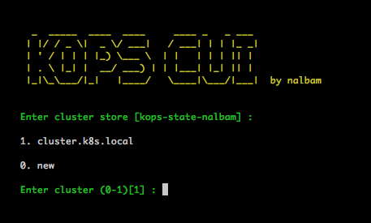
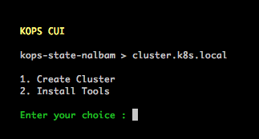
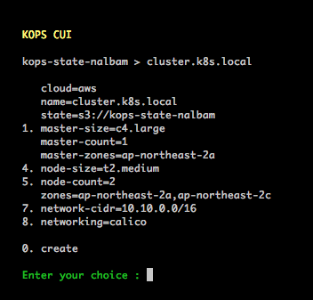
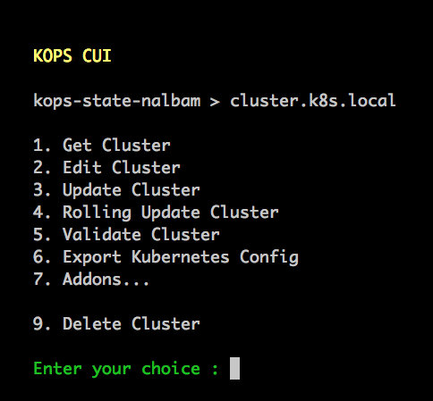
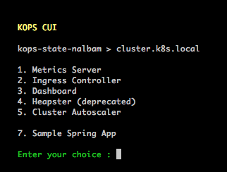

# kops-cui

KOPS Console User Interface

> It is a CUI that helps you install Kubernetes Cluster easily with KOPS.

* Support Cloud
  * AWS

* Support Addon
  * Metrics Server
  * Ingress Controller
  * Dashboard
  * Heapster (deprecated)
  * Cluster Autoscaler

* Support OS
  * MacOS
  * Linux (centos, ubuntu ...)

## Run

```bash
git clone https://github.com/nalbam/kops-cui
./kops-cui/run.sh
```

### Configure



### Create Cluster







### Addons


